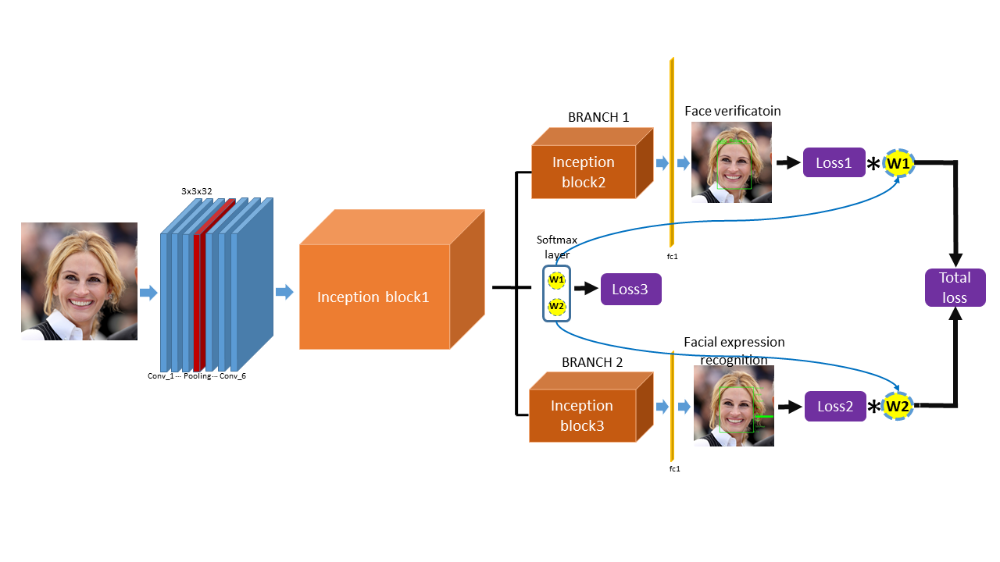
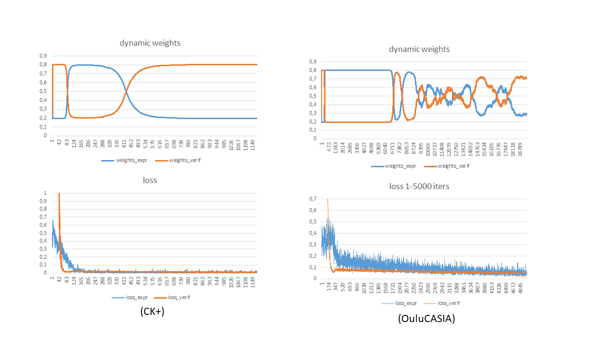

# Multi-Task Learning Using Dynamic Weights of Tasks for Face Recognition with Facial Expression
This is the implementation of the [Multi-Task Learning Using Dynamic Weights of Tasks for Face Recognition withFacial Expression](https://arxiv.org/pdf/1911.03281.pdf), which   simultaneously  perform  face  recognition  with  facialexpression and facial expression recognition with dynamic weights of tasks.  The dynamic weights of tasks can generate automatically with  a softmax like structure so called dynamic-weights-unit according to the difficulty of the training of tasks. No more hyperparameters are introduced for generating the dynamic weights. The demo is realized in TensorFlow1.6, Python 2.7 and openCV 3.0 under Unbuntu 16.4. The proposed architecture is shown in .

## Dynamic weights in multi-task learning 
The generating dynamic weights can automatically focus on the training of the hard task in the multi-task learning. The hard task with larger loss is always assigne with the larger weight of the task which force the networks to train the hard task primarily instead of the over-training of the easy task. In this way, the training of the multi-task is more efficient as shown in . 

## Dependencies
- The code is tested on Ubuntu 16.04.

- install Tensorflow 1.6 (with GPU)

- install opencv 2.4.13.

- install python 2.7

 
## Pretrained model
The pretrained model for FaceLiveNet1.0 is [here](https://drive.google.com/file/d/1B-ZRtWk1UoAQXHTewhKV5UPvwP3L102X/view?usp=sharing)

## Training
The face verification networks is trained on the [CASIA-WebFace](http://www.cbsr.ia.ac.cn/english/CASIA-WebFace-Database.html), [MSCeleb](https://www.msceleb.org/), the facial expression recognition networks branch is trained on the  [CK+](http://www.consortium.ri.cmu.edu/ckagree/), [OuluCasia](http://www.cse.oulu.fi/CMV/Downloads/Oulu-CASIA), 

## Face alignment
The face detection is implemented by the [Multi-task CNN (Joint Face Detection and Alignment using Multi-task Cascaded Convolutional Networks).The paper for MTCNN)](https://kpzhang93.github.io/MTCNN_face_detection_alignment/index.html).

### Examples for command line:

Training & Evaluation the model:
python facenet_expression_realdynamic_L1L2L3_ck+_oulu.py --logs_base_dir /data/zming/logs/expression --models_base_dir /data/zming/models/expression --data_dir /data/zming/datasets/Oulu-Casia/VL_Strong_mtcnnpy_182_160 --labels_expression /data/zming/datasets/Oulu-Casia/Emotion_labels_VIS_Strong_Six.txt --image_size 160 --model_def ./models/inception_resnet_v1_expression_simple.py --optimizer RMSProp --learning_rate -1 --max_nrof_epochs 10000 --keep_probability 0.5 --learning_rate_schedule_file ../data/learning_rate_schedule_classifier_oulucasia.txt --weight_decay 5e-5 --center_loss_factor 1e-1 --center_loss_alfa 0.5 --gpu_memory_fraction 0.7 --epoch_size 100 --batch_size 90 --pretrained_model /data/zming/models/expression/20180113-231253/best_model --lfw_dir /data/zming/datasets/lfw/lfw_mtcnnpy_160 --nfold 10 --ifold 4 --learning_rate_decay_epochs 5 --expr_pairs ../data/IdentitySplit_4th_10fold_oulucasiapairs_Six.txt --learning_rate 1e-4

## parameters:
--logs_base_dir, --models_base_dir: the path to save the log and training model
--data_dir: training images 
--labels_expression: the labels of the facial expressions of the images
--image_size: the required image size for training
--model_def: the networks architecutre used in this work
--optimizer: optimizer for the BP of the parameters of CNNs
--learning_rate: setting of learning rate, if it is <0, the configuration file --learning_rate_schedule_file for setting the learning will be used
--pretrained_model: the path to the pretrained model
--center_loss_factor : centerloss weight in the full loss function
--expr_pairs: the evaluation pairs used for face verification with facial expression

### Citation
    @article{ming2019dynamic,
      title={Dynamic Multi-Task Learning for Face Recognition with Facial Expression},
      author={Ming, Zuheng and Xia, Junshi and Luqman, Muhammad Muzzamil and Burie, Jean-Christophe and Zhao, Kaixing},
      journal={arXiv preprint arXiv:1911.03281},
      year={2019}
    }

### License
This code is distributed under MIT LICENSE

### Contact
Zuheng Ming
zuheng.ming@univ-lr.fr
